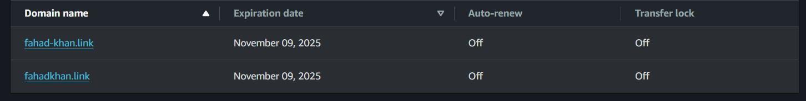
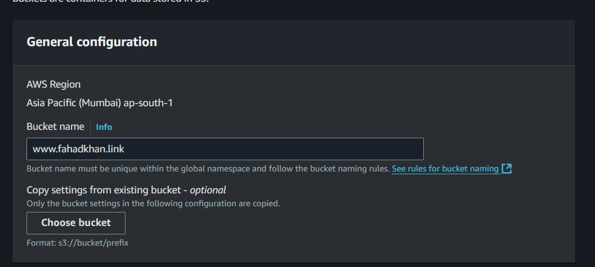
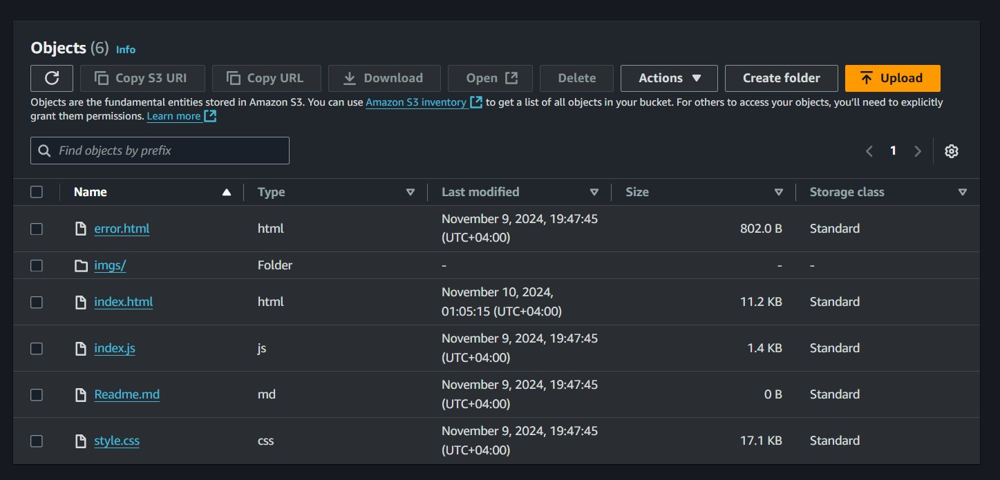
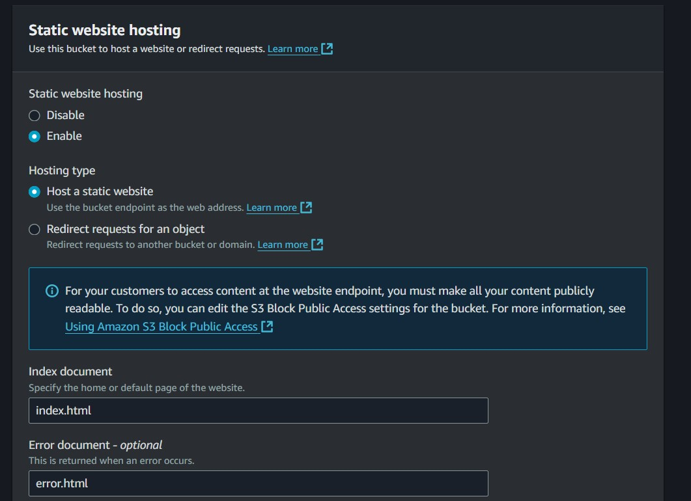
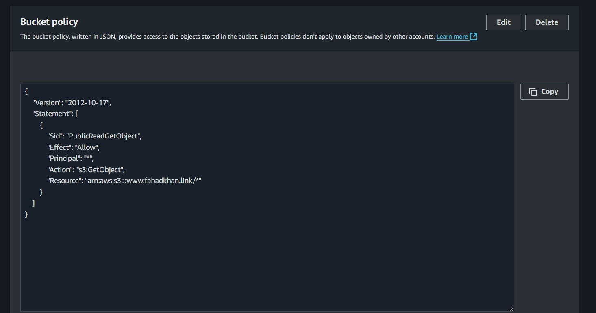
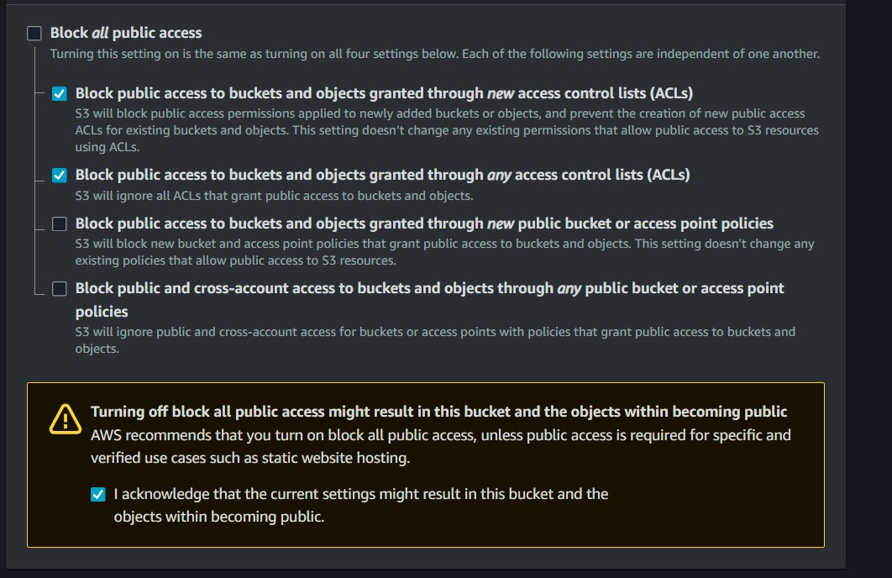
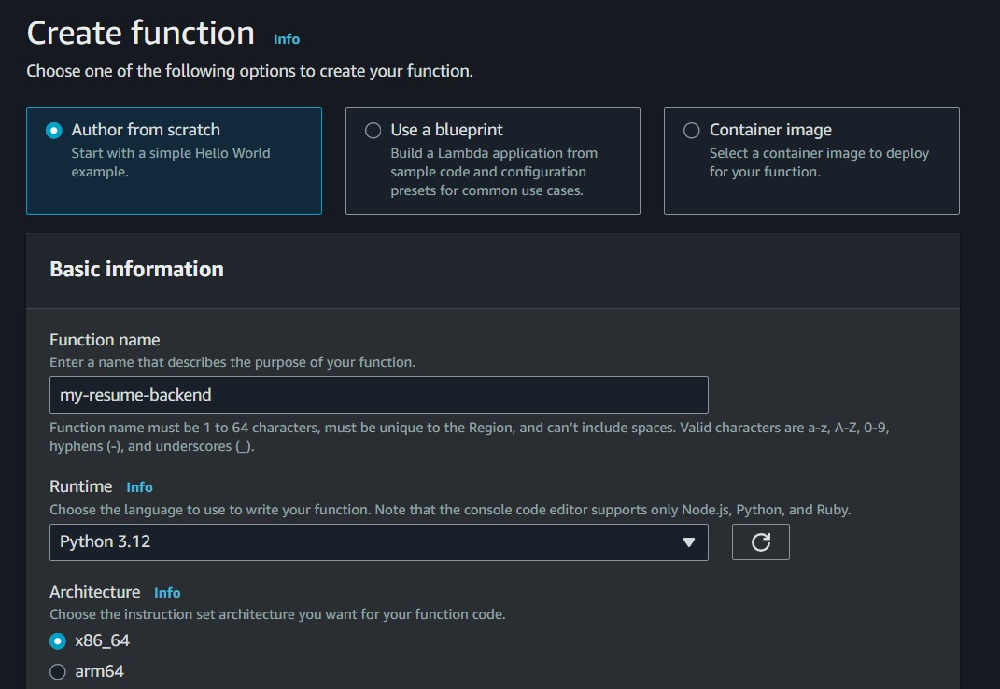

<h1>AWS CLOUD RESUME</h1>

This is the overview of how i created my aws resume

<h2>Architectural diagram of my project</h2>

<ul><h4>The services used in the above architectural diagram</h4>
    <li><strong>Route 53</strong>: This service is used to point my custom domain (<em>www.fahadkhan.link</em>) to my CloudFront distribution.</li>
    <li><strong>CloudFront</strong>: This AWS service is used to make my static website in the S3 bucket accessible worldwide with improved speed and HTTPS support.</li>
    <li><strong>AWS Certificate Manager</strong>: I used this AWS service to create an SSL/TLS certificate for use with my CloudFront distribution.</li>
    <li><strong>AWS API Gateway</strong>: I used this service to create a REST API for my backend, which connects Lambda to the frontend to provide the visitor count.</li>
    <li><strong>AWS Lambda</strong>: I used this service to create a function triggered by AWS API Gateway. This function fetches data, performs the necessary computations, and then sends the results to DynamoDB and API Gateway.</li>
    <li><strong>AWS DynamoDB</strong>: This NoSQL database stores the visitor count for the website.</li>
</ul>

<h2>Step-by-Step Procedure of How I Did It</h2>

<strong>Step 1</strong>: Created my website using HTML, CSS, and JavaScript.

<strong>Step 2</strong>: Purchased a domain name (I actually got two by mistake, but only used one).

<strong>Step 3</strong>: Created an S3 bucket and uploaded the website files to it.

<strong>Step 4</strong>: Enabled static website hosting for the S3 bucket.

<strong>Step 5</strong>: Configured a bucket policy and disabled <strong>BLOCK ALL PUBLIC ACCESS</strong> on the bucket to make the static website publicly accessible.

<strong>Step 6</strong>: I created a table in DynamoDB to store visitor count data.

<strong>Step 7</strong>: Next, I created a Lambda function to retrieve data from the DynamoDB table, perform computations, and send the result back to AWS API Gateway, while storing the updated data in DynamoDB.

<strong>Step 8</strong>: Then, I created a REST API in AWS API Gateway. This API serves as the entry point to the backend, triggering the Lambda function, which returns the visitor count to the website.

<strong>Step 9</strong>: I obtained an SSL/TLS certificate from AWS Certificate Manager to enable HTTPS on CloudFront. S3 static website hosting doesn’t support HTTPS directly, so using CloudFront with ACM was necessary.

<strong>Note:</strong> Make sure to create the certificate in the <em>us-east-1</em> region, as AWS CloudFront only supports certificates from that region.

<strong>Step 10</strong>: Lastly, I added two DNS records in Route 53 to point the custom domain to the CloudFront distribution.

<strong>Step 11</strong>: After that, I created a CloudFront distribution, added my S3 bucket as an origin, and attached the SSL/TLS certificate obtained from AWS Certificate Manager.

